<a href="https://underove.github.io/">
<picture>
  <source media="(prefers-color-scheme: dark)" srcset="dark.svg">
  
</picture>
</a>

  🌐 <a href="https://underove.github.io/">underove.github.io</a>
  &nbsp;·&nbsp;
  ✉️ <a href="mailto:swjohn0121@gmail.com">swjohn0121@gmail.com</a>

### 🌱 More About Me

🔬 My roots are in hardware — **drone flight control & satellite attitude systems** — which taught me to respect latency, constraints, and things that break in the real world. I carry that mindset into **computer vision and reliable language-model reasoning**.  

🧩 Recent work: **Curat3R** (single-image 3D reconstruction) and **Pi-FiRi** (a vision + LLM robot with hallucination-controlled reporting).  

👾 Most of my work grew out of **ToBig's**, an AI & Big-data analysis society, where I served as **23rd-cohort operations lead** — running sessions, authoring datathon problems, and shipping team projects end to end.
